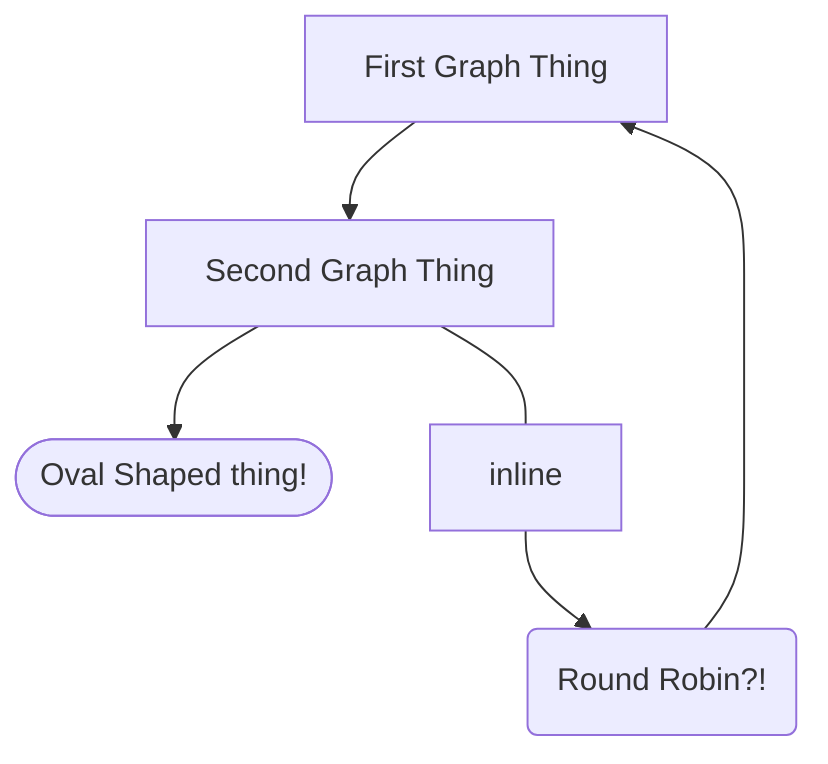

# Yes, Hello and Welcome

This is just a simple project of simple words.

Actually if you dig a little deeper you will find that it is more appropriate to
call it a simple project of simple letters, but that is all semantics and I digress...
Yeah so this is just a little outline of some of the capabilities and the
plugins that I found that are good, which those are.

## [mkdocs-monorepo-plugin](https://github.com/backstage/mkdocs-monorepo-plugin)

A handy dandy fella that allows for subfolders with thier very own settings
files (mkdocs.yml). This is nice because otherwise you have to determine
the structure of your nav menu all in the one main mkdocs.yml which I can
see getting cumbersome once there is quite a bit of material involved.

## [mkdocs-mermaid2-plugin](https://github.com/fralau/mkdocs-mermaid2-plugin)

A handy thingy for adding diagrams into the mix, I like diagrams and I hope you
do too!

Anyways, yeah, fairly simple to grasp.

## [mkdocs-autolinks-plugin](https://github.com/midnightprioriem/mkdocs-autolinks-plugin)

This one is a fairly straightforward one, allows for easier linking. As in
instead of linking `[Reference Diagrams](../reference/diagrams.md)` we can
just go ahead and go `[Reference Diagrams](diagrams.md)`. Though to be fair,
I have no idea how this will play with the monorepo plugin because that allows
for several different say, index.md files per different project... Well,
how about we give it a go?

This definitely didn't work, nevermind that it isn't installed here...
