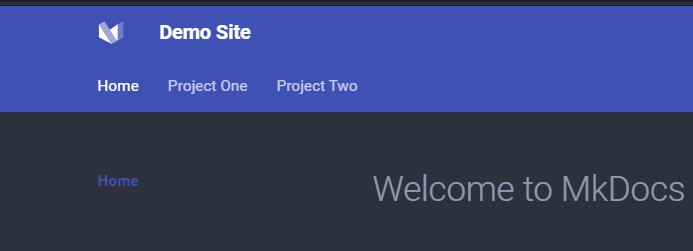

# Welcome to MkDocs

For full documentation visit [mkdocs.org](https://www.mkdocs.org).
Start by having python > 3.9 installed and on your path. Probably `python -m venv .venv`
or somwething like that, then activate it with `. .\.venv\Scripts\activate`
after that install Material for MkDocs and our plugins...

* `python -m pip install mkdocs-material`
* `python -m pip install mkdocs-minify-plugin`
* `python -m pip install mkdocs-redirects`
* `python -m pip install mkdocs-monorepo-plugin`

Once that is installed then you can give yourself a blank slate with
`mkdocs new .` which will give you the minimal install, it is bad.
From there to make things not awful we can just head over to the
[Material for MkDocs Repo](https://github.com/squidfunk/mkdocs-material),
snag a copy of it, replace the mkdocs.yml in our root with the one
from the repo, then sang over the `material` directory for some nice styles.
Then customize the mkdocs.yml to your liking, including adding in monorepo
under plugins:

```yaml
plugins:
    - monorepo
```

From here pretty much just follow the projectlayout below. When ready feel
free to fire up a local dev server at [http://localhost:8000](http://localhost:8000)
and preview your handywork with `mkdocs serve`

## Commands

* `mkdocs new [dir-name]` - Create a new project.
* `mkdocs serve` - Start the live-reloading docs server.
* `mkdocs build` - Build the documentation site.
* `mkdocs -h` - Print help message and exit.

## Monorepo Projects

In order to utilize monorepo we have to pretty much rip out everything from
our root `mkdocs.yml` in the nav section:

```yaml
# Page tree
nav:
  - Home: index.md
  - Project One: '!include docs\project-one\mkdocs.yml' # 
  - Project Two: '!include docs\project-two\mkdocs.yml'
```
which will give us something like the following image.



## Project layout (with monorepo)

```tree
    mkdocs.yml    # The configuration file.
    material/     # Borrowed from Material for MkDocs Repo (assets and stuff)
    docs/
        index.md  # The documentation homepage.
        ...       # Other markdown pages, images and other files.
        project-one/    # A project
            mkdocs.yml  # Has a site_name and nav section for the project folder
            docs/
                index.md    # Landing page for this specific project
                ...         # Other project pages
        project-two/    # Another project
            mkdocs.yml  # Each project needs a base mkdocs.yml
            docs/
                index.md    # Landing page for this specific project
                ...         # Other project pages
```
